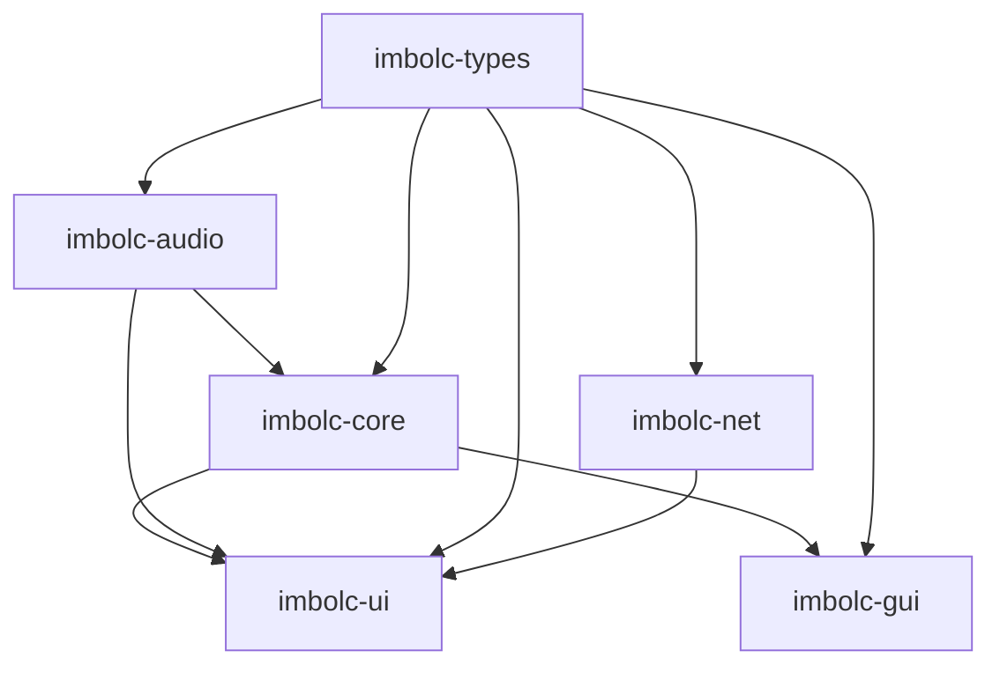
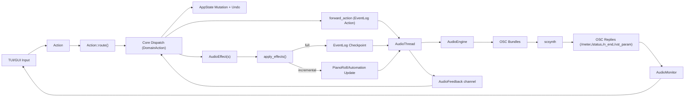

# Imbolc Architecture Deep Dive

This is a code-verified architecture map of the current workspace, centered on realtime audio behavior, state/dispatch design, and optional collaboration mode.

## Workspace Topology

Imbolc is a multi-crate Rust workspace:

- `imbolc-types`: shared data model and action/reducer types.
- `imbolc-audio`: realtime audio subsystem and SuperCollider integration.
- `imbolc-core`: app state, dispatch orchestration, persistence, config.
- `imbolc-ui`: terminal app (ratatui/crossterm) runtime and panes.
- `imbolc-gui`: experimental Dioxus desktop UI.
- `imbolc-net`: optional LAN collaboration protocol/server/client.

Dependency direction is intentionally one-way:

## Runtime Architecture (Standalone TUI)

The default app runtime is owned by `imbolc-ui/src/runtime/mod.rs` and is split into focused subsystems:

- `input`: event polling, layer resolution, pane/global routing.
- `audio_sync`: batched `AudioEffect` flush to audio thread.
- `feedback`: drains async I/O, audio feedback, and MIDI input.
- `render`: ~60 fps throttled redraw and meter/scope refresh.

`AppRuntime` owns:

- `LocalDispatcher` (domain state mutation).
- `AudioHandle` (main-thread API into audio thread).
- `PaneManager` + `LayerStack`.
- `Frame` and MIDI manager.

Startup flow:

1. Load config + keybindings.
2. Construct `AppState`.
3. Spawn audio thread via `AudioHandle::new()`.
4. Push initial full audio sync (`audio.sync_state(&state)`).
5. Optionally load project path from CLI arg.
6. Auto-start scsynth and connect (`setup::auto_start_sc`).

Main loop order:

1. `process_events()` (input/action routing)
2. `process_tick()` (pane time-based actions)
3. `apply_pending_effects()`
4. `drain_io_feedback()`
5. `drain_audio_feedback()`
6. `drain_midi_events()`
7. `maybe_render()`

## Action Model and Dispatch Contract

The central action model lives in `imbolc-types/src/action.rs`.

- `Action` is the top-level UI-emitted intent.
- `Action::route()` returns `RoutedAction::{Ui, Domain}`.
- `DomainAction` is the only category that mutates core state.

Dispatch is split cleanly:

- UI-layer actions (pane nav, quit intent, layers) are handled in UI runtime.
- Domain actions are handled in `imbolc-core/src/dispatch/mod.rs::dispatch_action`.

`LocalDispatcher` (`imbolc-core/src/dispatch/local.rs`) does:

1. Domain dispatch to mutate `AppState`.
2. Incremental audio projection via `audio.forward_action(action, effects)`.
3. `needs_full_sync` escalation for unreducible actions.

### Shared Reducer Strategy

A key architectural decision is the shared pure reducer in `imbolc-types/src/reduce/mod.rs`.

- `reduce_action()` mutates only `InstrumentState` + `SessionState`.
- `is_reducible()` identifies actions safe for incremental audio-thread projection.
- Both `imbolc-core` and `imbolc-audio` use this reducer.

This avoids divergent mutation logic between main and audio threads.

## State and Persistence

`AppState` (`imbolc-core/src/state/mod.rs`) aggregates:

- `session` (global timeline/mixer/music settings),
- `instruments`,
- clipboard,
- I/O status,
- recording/audio feedback mirrors,
- undo history,
- project metadata,
- MIDI connection state,
- optional network context.

### Undo Model

Undo snapshots are scope-aware (`UndoScope`):

- single instrument,
- session,
- full state.

Dispatch auto-pushes undo snapshots before mutation for undoable actions.

### Persistence Model

Persistence (`imbolc-core/src/state/persistence`) uses SQLite relational schema (current `SCHEMA_VERSION = 12`):

- save is transactional (WAL + explicit transaction),
- load supports relational and legacy blob fallback,
- checkpoint system stores full blobs plus optional binary changesets.

Checkpoints support create/list/restore/delete in-project.

## Audio Threading and Concurrency Model

`AudioHandle` (`imbolc-audio/src/handle.rs`) is the main-thread facade and owns three channels of communication:

- priority command channel (`AudioCmd` time-critical),
- normal command channel (`AudioCmd` non-critical),
- event log (`EventLogWriter`) for projected state changes.

Audio feedback returns via std mpsc (`AudioFeedback`).

### Why Event Log Instead of "State Sync Commands"

State projection is log-based (`imbolc-audio/src/event_log.rs`):

- `LogEntryKind::Action` (incremental reducible actions),
- `Checkpoint` (full state replacement),
- `PianoRollUpdate`,
- `AutomationUpdate`.

The event log is both transport and retained history.

### Audio Thread Loop

`AudioThread::run()` (`imbolc-audio/src/audio_thread.rs`) runs a dedicated loop with strict prioritization:

1. `select!` over priority/normal channels with tick timeout.
2. Drain priority queue (budget: 200 us, count cap 128).
3. Drain event log (budget: 100 us).
4. Drain normal queue (budget: 100 us, count cap 64).
5. Tick every 500 us (`TICK_INTERVAL`).
6. Poll engine (server status, compile/export state, routing phases, telemetry).

Priority commands include:

- voice spawn/release/drum hits,
- targeted param changes,
- play/stop/BPM/playhead,
- automation apply.

This minimizes latency under heavy control-plane load.

## Playback Scheduling and Timing

Playback engine: `imbolc-audio/src/playback.rs`.

Key mechanisms:

- f64 fractional tick accumulator to avoid truncation drift.
- dynamic lookahead from device config:
  - `max(buffer_size/sample_rate + 5ms, 10ms)`,
  - default 15ms if unknown.
- high-water pre-scheduling (`last_scheduled_tick`) to avoid double scheduling.
- loop-boundary-aware scan windows with wrap handling.

Per-note runtime modifiers:

- probability,
- swing (8th/16th/both grids),
- humanize timing and velocity,
- per-track groove overrides vs session defaults,
- layer-group fanout.

Other tick domains:

- drum sequencer (`drum_tick.rs`),
- arpeggiator (`arpeggiator_tick.rs`),
- click track (`click_tick.rs`).

## SuperCollider Engine Internals

The core SC driver is `AudioEngine` (`imbolc-audio/src/engine/mod.rs`).

Execution ordering uses fixed SC groups:

- `100` sources,
- `200` processing,
- `300` outputs,
- `350` bus/layer-group processing,
- `400` record,
- `999` safety/analysis.

### Routing Graph Construction

Routing is in `engine/routing.rs`.

Per instrument chain:

`source -> lfo(optional) -> filter(optional) -> eq(optional) -> effects* -> output`

Additional graph pieces:

- instrument sends (pre/post insert tap point),
- bus effect chains + bus outputs,
- layer-group effect chains + outputs + sends.

Incremental routing ops exist for:

- add instrument,
- delete instrument,
- rebuild single instrument,
- rebuild bus processing.

Full rebuild also has phased mode (`RoutingRebuildPhase`) to amortize work across ticks.

### Voice Lifecycle

Voice logic: `engine/voices.rs` + `engine/voice_allocator.rs`.

Important details:

- max 64 active voices/instrument,
- same-pitch retrigger steals prior voice,
- steal scoring prefers released voices, then quiet/old active voices,
- control bus triples are pooled and reused,
- anti-click release path forces gate low then delayed free,
- `/n_end` is used as authoritative node-free signal for cleanup and bus return.

### VST Hosting

VST is hosted through SuperCollider VSTPlugin wrappers:

- source instrument wrapper: `imbolc_vst_instrument`,
- effect wrapper: `imbolc_vst_effect`,
- commands via `/u_cmd` (`/open`, `/set`, `/midi_msg`, program read/write),
- parameter discovery through `/param_query` + `/vst_param` replies.

## OSC, Monitoring, and Lock-Free Data Sharing

### Timetag Generation

OSC timetags are generated with a monotonic anchor (`osc_time_from_now`) to avoid wall-clock jump artifacts.

### Send Path

Timed bundles are encoded and queued to dedicated sender thread (`osc_sender.rs`, bounded queue size 512).  
If queue is full/unavailable, engine falls back to direct send.

### Receive/Monitor Path

`AudioMonitor` (`osc_client.rs`) is shared between OSC receiver and UI/main thread:

- atomics for scalar metrics (`meter`, `SC CPU`, latency),
- triple buffers for complex frames (waveform map, spectrum, LUFS, scope),
- channel handoff for VST param replies and `/n_end` events.

This keeps OSC receive path lock-light and UI reads non-blocking.

## Server Lifecycle and Control Plane Separation

Server management is in `engine/server.rs` and audio-thread polling:

- scsynth spawn can run async (`start_server_async`),
- OSC connect can run async (`connect_with_monitor_async`),
- deferred post-spawn connect avoids blocking while server initializes,
- periodic health checks detect dead child process,
- compile/load synthdefs is asynchronous and polled.

Heavy operations are intentionally moved out of the hot realtime loop.

## Recording, Bounce, and Export

Recording subsystem: `engine/recording.rs`.

- `StartRecording`: alloc buffer + open write + start `imbolc_disk_record`.
- stop: free disk node + close buffer, delayed buffer free (~500ms).
- master bounce and stem export follow similar multi-recording flow.
- export completion and progress are driven from audio thread playback tick state.

## Optional Networking Architecture (`--features net`)

Networking is split between `imbolc-net` and UI integration in `imbolc-ui/src/network.rs`.

### Model

- authoritative single server process runs audio + dispatch.
- clients send `NetworkAction` only.
- server applies actions, broadcasts `StatePatch` or full sync.
- no audio streaming over network; only control/state + metering.

### Patch Strategy

`DirtyFlags` in server tracks granular deltas:

- per-instrument,
- per-track piano roll,
- per-lane automation,
- per-bus mixer,
- structural fallback to full subsystem/session sync.

Writer thread keeps per-client outboxes with frame kinds:

- metering (droppable),
- patch (supersedable),
- full sync,
- control (non-droppable).

Includes heartbeat, privilege ownership model, and reconnect tokens.

## GUI (`imbolc-gui`) Status

The Dioxus GUI is a parallel frontend using core/audio directly:

- owns `SharedState { AppState, AudioHandle }`,
- dispatches through `imbolc_core::dispatch::dispatch_action`,
- applies `AudioEffect` similarly to TUI,
- polls audio feedback on async interval (~33ms).

It shares backend architecture, but feature/UI coverage is still behind the TUI.

## End-to-End Dataflow Summary

## Key Source Landmarks

- `imbolc-ui/src/runtime/mod.rs` - app runtime loop composition.
- `imbolc-core/src/dispatch/mod.rs` - domain dispatch entrypoint.
- `imbolc-core/src/dispatch/local.rs` - state owner + audio forwarding.
- `imbolc-types/src/action.rs` - `Action`, routing, `AudioEffect`.
- `imbolc-types/src/reduce/mod.rs` - shared pure reducer.
- `imbolc-audio/src/handle.rs` - main-thread audio API + sync strategy.
- `imbolc-audio/src/audio_thread.rs` - realtime loop and command handling.
- `imbolc-audio/src/playback.rs` - scheduling and transport tick logic.
- `imbolc-audio/src/engine/routing.rs` - graph build/rebuild internals.
- `imbolc-audio/src/engine/voices.rs` - spawn/release/anti-click logic.
- `imbolc-audio/src/osc_client.rs` - OSC transport + monitor updates.
- `imbolc-core/src/state/persistence/*` - SQLite schema/save/load/checkpoints.
- `imbolc-net/src/server.rs` - collaboration server + patch broadcaster.
